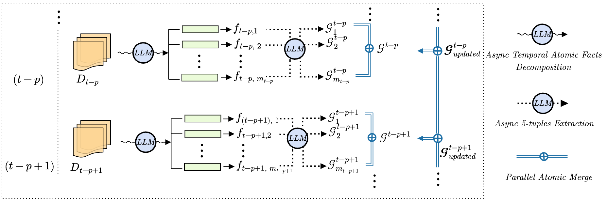
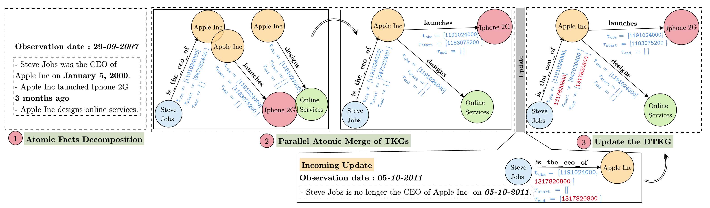
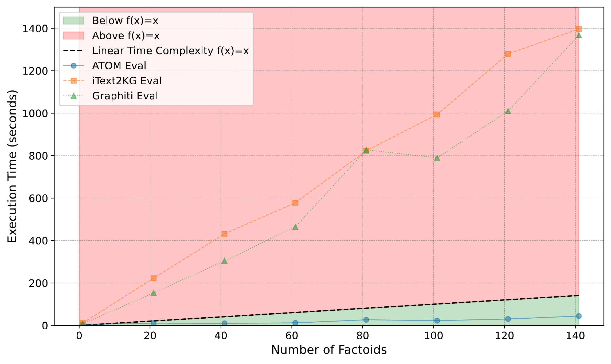
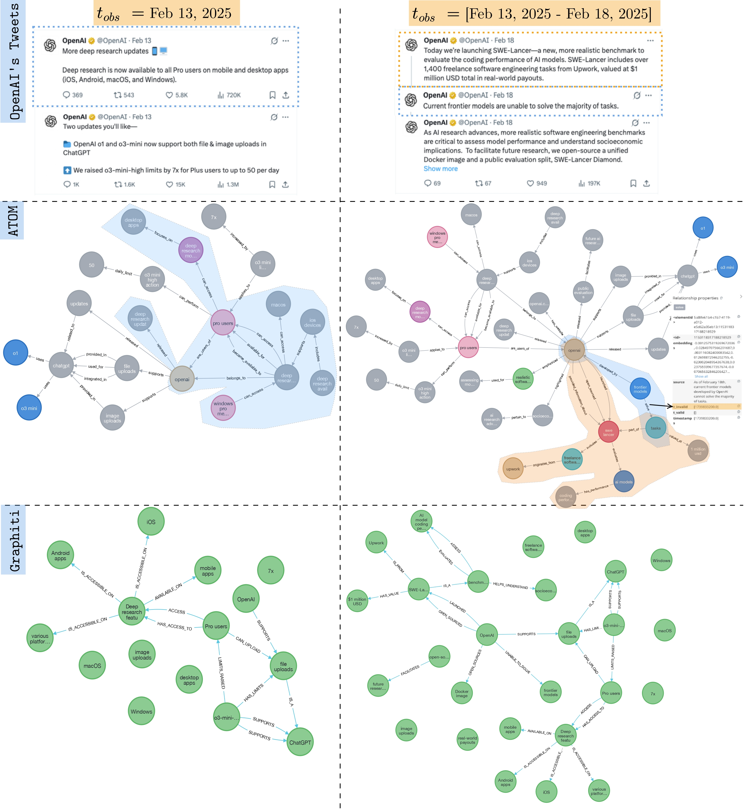
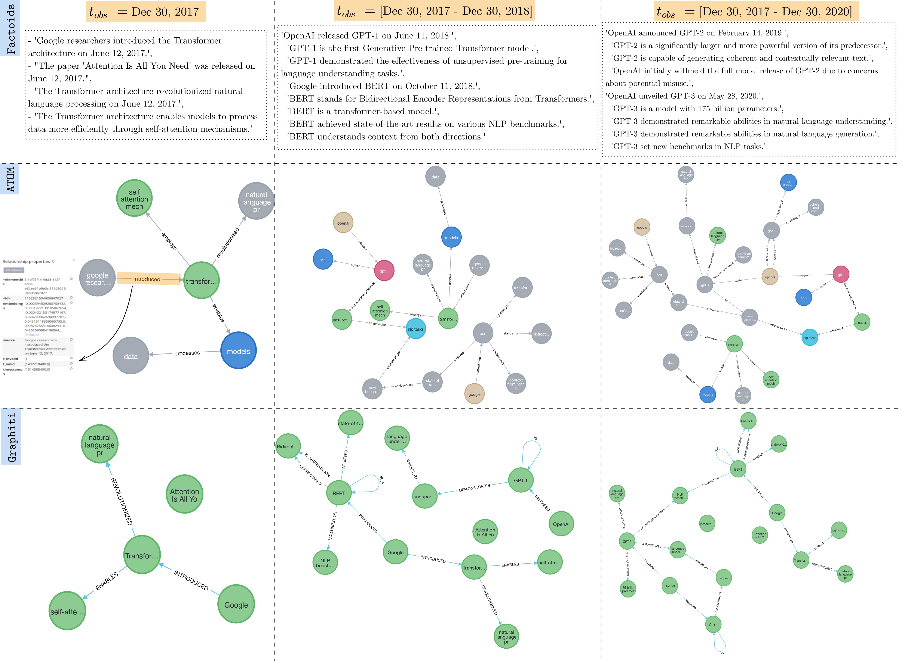

# ATOM: AdapTive and OptiMized Temporal Knowledge Graph Construction

[](https://github.com/geeekai/atom/fork)
[](https://github.com/geeekai/atom)

**ATOM** (AdapTive and OptiMized) is a scalable framework for building and continuously updating **Temporal Knowledge Graphs (TKGs)** from timestamped texts. This repository implements a few-shot approach that splits input data into minimal, self-contained “atomic” facts. From these atomic facts, small atomic KGs are derived and then merged **in parallel** to preserve **semantic** and **temporal** consistency at scale.

---

## Key Features

- **Few-Shot Extraction**: No extensive domain-specific fine-tuning is required.
- **Atomic Fact Splitting**: Processes small, self-contained text segments to minimize the “forgetting effect.”
- **Dual-Time Modeling**: Distinguishes between **inherent timestamps** (when the fact actually occurs) and **observation timestamps** (when the fact is ingested).
- **Parallel Architecture**: Merges Knowledge Graphs (KGs) in parallel without repeated LLM prompts for merging.
- **Stable & Exhaustive**: Ensures consistent outputs across multiple LLM runs while capturing as many facts as possible.
- **Continuous Updates**: Seamlessly accommodates new information while preserving previously ingested data.


## ATOM's Architecture

ATOM’s architecture is designed to dynamically construct Temporal Knowledge Graphs from unstructured, time-stamped text by first decomposing documents into atomic facts—small, self-contained segments that reduce the “forgetting effect” in LLMs, and then extracting subject, relation–object 5-tuples along with both inherent and observation timestamps. These extracted 5-tuples form atomic KGs that are merged in parallel using vector-based matching and threshold criteria to resolve entity and relationship conflicts, while a dual-time modeling approach maintains historical records and manages temporal inconsistencies. This modular and parallel design ensures high scalability, robustness, and continuous updates in dynamic, real-world data environments.

<p align="center">
  
</p>

---

## Example of the ATOM Workflow

<p align="center">
  
</p>

1. **Document Distillation**: Input text is split into atomic facts—short, self-contained chunks—by a lightweight documents distiller.
2. **5-tuple Extraction**: Each atomic fact is converted into subject–relation–object 5-tuples, including `t_start` and `t_end` timestamps.
3. **Atomic KG Construction**: For each atomic fact, a miniature “atomic KG” is constructed with embedded entities and relationships.
4. **Parallel Merging**: All atomic KGs are merged in parallel using entity- and relation-matching thresholds to maintain consistency.
5. **Temporal Conflict Resolution**: ATOM manages temporal conflicts by employing a dual-time modeling approach that distinguishes between the observation time of a fact and its inherent time. The framework's strategy is to resolve these conflicts before its large-scale parallel merge, which enhances scalability by not needing to re-prompt a Large Language Model (LLM) during the merge process. It handles negated temporal statements, such as "is no longer the CEO," by converting them into affirmative forms while marking the specific time as invalid, which allows for easier matching with the corresponding "beginning action" facts. During the binary merge stage, if two relations are determined to be similar, their timestamp lists for $\tau_{start}$, $\tau_{end}$, and observation time are consolidated by appending the new timestamps to the existing lists, thereby preserving a complete history of the fact's temporal data. After the merge, this historical list of timestamps is analyzed to remove inconsistencies; for example, if a $\tau_{start}$ list appears as [2020, 2020, 2020, 2021], the 2021 value could be identified as a statistical outlier and pruned. Consequently, when the knowledge graph is queried, the median of the timestamp history is selected to represent the most consistent and reliable temporal value for that specific fact.
6. **TKG Updates**: Newly arrived data is merged into the existing TKG without reprocessing older information, enabling dynamic updates. 

For more technical details, check out:
- **`atom/atom.py`**: Core logic for building, merging, and updating the knowledge graphs.
- **`evaluation/`**: Notebooks demonstrating performance benchmarks, stability tests, and scalability studies.

---

## Latency & Scalability

<p align="center">
  
</p>

- **Parallel Merging**: ATOM’s parallel merging strategy significantly reduces overall latency, as illustrated in the above figure.
- **Scalability**: Merging is performed without additional LLM prompts, making it feasible to scale to millions of nodes in real-world deployments.

---

## Installation

1. **Clone or Fork** the repository:
   ```bash
   git clone https://github.com/geeekai/atom.git
   cd atom


2. **Install Requirements**

Install all dependencies by running:

```bash
pip install -r requirements.txt
```

3. **(Optional) Set Up a Virtual Environment**
It is recommended to use a virtual environment (e.g., conda, venv) to isolate dependencies.

# Example: Building a Temporal Knowledge Graph (TKG) with ATOM from LLMS History

In this example, we demonstrate how to use ATOM to extract factoids from a dataset, build a dynamic Temporal Knowledge Graph (TKG) across different observation timestamps, and finally visualize the graph using Neo4j.

The process involves:
1. **Loading Data**: Reading an Excel file containing LLMS history with associated observation dates.
2. **Factoid Extraction**: Using the `LangchainOutputParser` to extract factoids from the text.
3. **Graph Construction**: Grouping factoids by observation date and building a knowledge graph that merges atomic KGs from different timestamps.
4. **Visualization**: Rendering the final graph using the GraphIntegrator module connected to a Neo4j database.

Below is the derived example code:

---

```python
import pandas as pd
import asyncio
import ast

# Import LLM and Embeddings models using LangChain wrappers
from langchain_openai import ChatOpenAI, OpenAIEmbeddings
from atom.utils import LangchainOutputParser, Factoid
from atom import Atom
from atom.graph_integration import GraphIntegrator

# Set up the OpenAI LLM and embeddings models (replace "##" with your API key)
openai_api_key = "##"
openai_llm_model = ChatOpenAI(
    api_key=openai_api_key,
    model="gpt4o-mini",
    max_tokens=None,
    timeout=None,
    max_retries=2,
)

openai_embeddings_model = OpenAIEmbeddings(
    api_key=openai_api_key,
    model="text-embedding-3-large",
)

# Initialize the Langchain output parser with the OpenAI models
lg = LangchainOutputParser(llm_model=openai_llm_model, embeddings_model=openai_embeddings_model)

# Load the LLMS history dataset (ensure the correct path to your Excel file)
llms_history = pd.read_excel("../datasets/llms_history_and_openai_posts/llms_history.xlsx")

# Define a helper function to convert the dataframe's factoids into a dictionary,
# where keys are observation dates and values are the combined list of factoids for that date.
def to_dictionary(df):
    # Convert factoid strings to lists if necessary
    if isinstance(df['factoids'][0], str):
        df["factoids"] = df["factoids"].apply(lambda x: ast.literal_eval(x))
    grouped_df = df.groupby("observation date")["factoids"].sum().reset_index()
    return {
        str(date): factoids
        for date, factoids in grouped_df.set_index("observation date")["factoids"].to_dict().items()
    }

# Convert the LLMS history dataframe into the required dictionary format
llms_history_dict = to_dictionary(llms_history)

# Initialize the ATOM pipeline with the OpenAI models
atom = Atom(llm_model=openai_llm_model, embeddings_model=openai_embeddings_model)

# Build the knowledge graph across different observation timestamps
kg = await atom.build_graph_from_different_obs_times(
    atomic_facts_with_obs_timestamps=llms_history_dict,
    rel_threshold=0.7,
    ent_threshold=0.8
)

# Visualize the resulting knowledge graph using Neo4j
URI = "bolt://localhost:7687"
USERNAME = "neo4j"
PASSWORD = "##"
GraphIntegrator(uri=URI, username=USERNAME, password=PASSWORD).visualize_graph(knowledge_graph=kg)
```

# Examples of DTKGs with varying observation dates

## Modeling the observation time
Both the observation time and the inherent time are stored as relation features in the DTKG. This dual time modeling facilitates flexible TKG querying. 
The observation time modeling is determined by the use case and user preferences, addressing the question of how quickly the graph should be updated. For example, in our datasets, the observation time has been simulated as an annual snapshot for LLMs News and as a per-post snapshot for OpenAI posts. The observation time ensures the dynamism of the TKG, while the inherent time directly reflects the timing of the facts. Neo4j is employed as the graph database for visualization.

## Comparison between ATOM and Graphiti
The overall tweet structure is effectively captured by Graphiti, although some isolated entities connected exclusively to episodic nodes are observed, thereby hindering the TKG structure. Additionally, entity types are discarded. The architecture of Graphiti is effective for small datasets, as entity resolution and temporal conflicts can be managed within an LLM prompt; however, its suitability diminishes for very large datasets.

ATOM effectively captures the tweet structure and maintains the DTKG's consistency and exhaustiveness through its factoid-based construction. The following figures illustrates temporal conflict resolution: when a negation with an associated timestamp is detected, the affirmative form is chosen and the time is stored as $\tau_{end}$. This enables merging with the corresponding fact when initiation information is available. If no date is provided, the negation is recorded as a negation relation. In contrast, Graphiti retains the negation and resolves it via the LLM, a process that is time-consuming and computationally expensive due to the need to include the entire TKG as context.


<p align="center">
  
</p>

<p align="center">
  
</p>


# Contributing

We welcome contributions! To help improve ATOM:
	1.	Fork this repository to your GitHub account.
	2.	Create a feature branch with your enhancements or bug fixes.
	3.	Submit a pull request detailing the changes.

Please report any issues via the Issues tab. Community feedback is invaluable!
